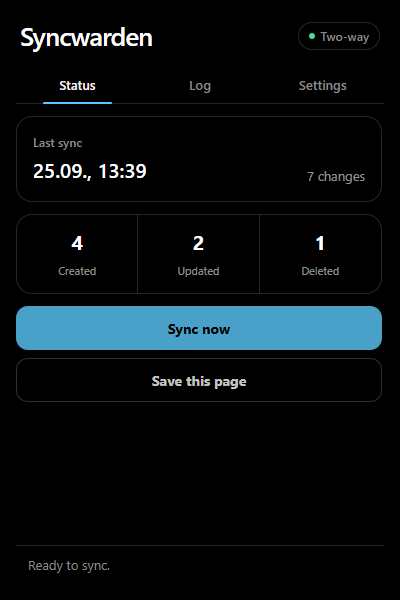
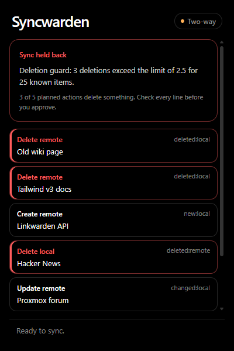
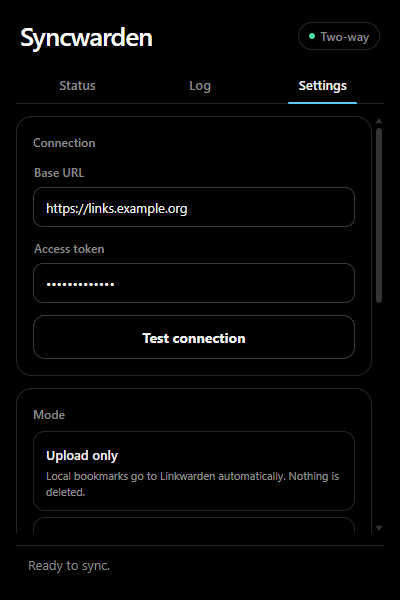

# Syncwarden

A Chromium extension that keeps your browser bookmarks in sync with a
self-hosted [Linkwarden](https://linkwarden.app/) instance: URLs, titles and
the folder structure, in the background.

<p>
  
  
  
</p>

<sub>Screenshots use sample data.</sub>

## Why this exists

I keep my bookmarks in Linkwarden and wanted the bookmarks bar in my browser
to be the same thing, without thinking about it.

The obvious tool for that is [Floccus](https://floccus.org/), which added
Linkwarden support in 2024. It's a mature, general bookmark sync tool that
works with a lot of backends. With my setup, though, I kept running into sync
problems and conflicts, and when a sync tool gets confused, the thing you lose
is bookmarks. Floccus also syncs into one dedicated collection; mapping
Linkwarden's top level straight onto the bookmarks bar has been an open request
since 2024 ([floccus#1805](https://github.com/floccusaddon/floccus/issues/1805)).

So Syncwarden does one thing, Linkwarden ↔ bookmarks, and is deliberately
careful about it:

- **It shows you the plan.** A dry run computes every create, update and
  delete without writing anything.
- **It doesn't mass-delete on its own.** If a sync would delete more than a
  handful of bookmarks, it stops and asks. You see every action before you
  approve it.
- **It keeps snapshots.** Before each batch of writes it saves your bookmark
  tree, and you can roll back from the popup.
- **It fails closed.** If Linkwarden answers in an unexpected way, or a
  bookmark changed between planning and writing, the run stops instead of
  guessing.
- **Your Linkwarden top level is your bookmarks bar.** Collections become
  folders, nested collections become nested folders.

If you need Firefox, mobile, or a backend other than Linkwarden, Floccus is the
better choice. [lwsync](https://github.com/WombatFromHell/lwsync) is another
small Linkwarden-only extension worth a look.

Built with [WXT](https://wxt.dev/), React and TypeScript as a Manifest V3
extension.

## Features

- Three sync modes, from upload-only to full two-way sync
- Syncs automatically when you change bookmarks and on an interval
- Manual sync and a log of the last 50 events
- Dry run: plan everything, write nothing
- Large deletions need your approval
- Snapshots before every write batch, restorable from the popup
- Picks up where it left off (safely) after the service worker restarts
- Links that already exist in Linkwarden with the same content are adopted,
  not duplicated
- Save the current tab to Linkwarden with one click

## Requirements

- A Chromium-based browser (Chrome, Chromium, Brave, Edge, Vivaldi)
- A reachable Linkwarden instance with `/api/v1`
- A Linkwarden access token

The extension talks to Linkwarden directly from the browser. There is no
server component.

## Install

Syncwarden is not in the Chrome Web Store (yet), so you load it as an unpacked
extension.

1. Download `syncwarden-<version>-chrome.zip` from the
   [latest release](https://github.com/Ariazonaa/syncwarden/releases/latest) and
   unzip it somewhere it can stay. Chrome loads the extension from that folder.
2. Open `chrome://extensions` and turn on developer mode.
3. Click "Load unpacked" and pick the unzipped folder.
4. Pin Syncwarden from the puzzle-piece menu if you want the button in the
   toolbar.

To update, replace the folder's contents with the new release and click the
reload icon on the extension's card. Keep the same folder: Chrome ties the
extension's ID, and with it your settings and sync state, to that path.

### From source

Needs a current Node.js (developed and tested with Node 24).

```sh
npm ci
npm run build      # unpacked build in .output/chrome-mv3/
npm run zip        # zip in .output/
```

## Setup

1. Create an access token in Linkwarden.
2. Open the Syncwarden popup and go to Settings.
3. Enter your Linkwarden base URL, e.g. `https://links.example.org`. A trailing
   `/api/v1` is removed automatically.
4. Paste the token.
5. Start with "Upload only", or turn on "Dry run" together with the mode you
   want.
6. Pick a sync interval between 5 and 120 minutes.
7. Click "Test connection". The browser asks once for access to your Linkwarden
   host.
8. Run a sync by hand and look at the status and the log.

Defaults: upload only, 15 minute interval, dry run off.

> [!CAUTION]
> Two-way mode syncs deletions in both directions. Do at least one dry run and
> check the log before you leave it running.

## Sync modes

| Mode | New entries | Changes | Deletions |
| --- | --- | --- | --- |
| Upload only | Browser → Linkwarden | Local wins and is uploaded | None. A known link missing in Linkwarden is created again |
| Additive | Both directions | Taken from the side that changed; local wins if both changed | None. An entry missing on one side is created there |
| Two-way | Both directions | Taken from the side that changed; local wins if both changed | Both directions, but only for entries Syncwarden already knows |

The first sync is additive even in two-way mode: something that only exists on
one side is never treated as deleted. If the same URL exists on both sides with
different titles or folders on the first sync, the plan is held back for you to
review.

## When it syncs

Bookmark changes are collected and handled together about 30 seconds later.
Changes in Linkwarden are noticed on the next interval or manual sync.

Syncs never run in parallel. Another trigger during a sync is queued and runs
afterwards. If the service worker restarts in the middle of a job, that job is
dropped and planned again from freshly read data.

## Folders and collections

Linkwarden collections are mirrored as nested folders in the bookmarks bar:

| Browser | Linkwarden |
| --- | --- |
| `Bookmarks Bar` | `Unorganized` |
| `Bookmarks Bar/Dev` | `Dev` |
| `Bookmarks Bar/Dev/Rust` | `Dev/Rust` |

"Other Bookmarks" and "Mobile Bookmarks" are synced too. Their root name stays
part of the collection path, e.g. `Other Bookmarks/Private`. New entries coming
from Linkwarden always land in the bookmarks bar.

Missing collections are created as needed. Links in collections shared with you
by someone else are left alone.

## How entries are matched

Entries are matched by a normalized URL:

- only `http://` and `https://` URLs,
- the fragment is dropped,
- `utm_*`, `fbclid`, `gclid` and `mc_eid` are ignored,
- query parameters are sorted,
- URLs with embedded credentials are skipped.

Title, original URL and folder/collection path are what gets synced. Several
bookmarks with the same normalized URL are logged as duplicates and never
deleted blindly.

Links that Syncwarden creates or adopts in Linkwarden get the tag
`browser-sync`. Other tags and Linkwarden-only data (description, icon, color,
pinned) are kept on updates. PDF and image entries in Linkwarden are not synced
as bookmarks.

## Safety

**Dry run.** Reads everything and builds a plan, but changes nothing in the
browser or in Linkwarden. The planned actions show up in the log.

**Deletion guard.** A plan is held back if it deletes more than
`max(5, 10% of known entries)`. You can review it in the popup and discard or
approve it. Before an approved plan runs, both sides are read again; if the
plan changed, you have to review it again.

**Snapshots.** Before every write batch (up to 10 actions) Syncwarden saves a
snapshot. The three newest are kept, each with the full local bookmark tree,
the sync state at that time and a slimmed-down list of the remote links for
diagnosis. Restoring replaces your local bookmarks with the saved state, after
making one more backup first.

> [!IMPORTANT]
> Restoring a snapshot only resets the bookmarks in your browser. Linkwarden is
> not rolled back. The sync state is cleared afterwards so the next run merges
> both sides additively.

**Fails closed.** Before updating or deleting anything, Syncwarden checks that
the target hasn't changed since planning. If the remote inventory is
incomplete, an API response looks unfamiliar or the collection hierarchy is
broken, the run stops without doing anything else.

## Permissions and privacy

- `bookmarks` to read and change bookmarks
- `storage` and `unlimitedStorage` for settings, state, log and snapshots
- `alarms` for automatic syncs
- `notifications` when a plan is held back
- `activeTab` to save the current page

Access to your Linkwarden host is an optional permission, requested only after
you enter the base URL.

The base URL, token, sync state and snapshots are stored in the extension's
local storage in your browser profile. The token is not encrypted there, so use
HTTPS for Linkwarden and a separate token you can revoke.

## Development

```sh
npm run dev          # dev build with reload
npm test             # tests
npm run test:watch   # tests in watch mode
npm run typecheck    # TypeScript
npm run build        # production build
npm run zip          # zip for distribution
```

Before committing, at least `npm test`, `npm run typecheck` and
`npm run build` should pass.

## Layout

```text
src/
├── adapters/              # browser bookmarks, Linkwarden, storage, snapshots
├── core/                  # URL keys, paths, sync planning
└── entrypoints/
    ├── background.ts      # MV3 service worker and scheduling
    └── popup/             # React popup
tests/                     # unit, integration and round-trip tests
public/icon/               # extension icons (PNG)
design/                    # icon sources (SVG)
docs/screenshots/          # README screenshots
wxt.config.ts              # WXT and manifest config
```

The planning in `src/core/` doesn't touch the browser or the network. The
adapters carry out the plan and save the sync state after every action that
succeeded.

## Limitations

- Chromium browsers only. Firefox orders its bookmark roots differently and
  isn't supported yet.
- Not in the Chrome Web Store; you load it unpacked (see Install).
- The access token is stored unencrypted in the browser profile.
- Changes made in Linkwarden show up on the next interval or manual sync, not
  instantly.
- PDF and image entries in Linkwarden are not turned into bookmarks.

## Issues and contributions

Bug reports and pull requests are welcome. If a sync did something you didn't
expect, the log in the popup and the "held back" plan usually show why;
please include that (minus anything private) in the issue.

## License

MIT, see [LICENSE](LICENSE).
